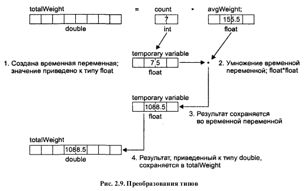
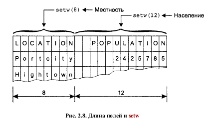

# Глава 1. ООП

**Процедурное программирование** -  программирование на императивном языке, при котором последовательно выполняемые операторы можно собрать в подпрограммы, то есть более крупные целостные единицы кода, с помощью механизмов самого языка.

Основополагающей идеей **объектно-ориентированного подхода** является объединение данных и действий, производимых над этими данными, в единое целое, которое называется объектом. Прямой доступ к данным невозможен. Данные сокрыты от внешнего воздействия, что защищает их от случайного изменения. Говорят, что данные и методы инкапсулированы. Термины сокрытие и инкапсуляция данных являются ключевыми в описании объектно-ориентированных языков.

**Наследование** - свойство в ООП позволяющее содавать *производные* классы на основе *базовых*.

Использование операций и функций различным образом в зависимости от того, с какими типами величин они работают, называется **полиморфизмом**. Когда существующая операция, например = или +, наделяется возможностью совершать действия над операндами нового типа, говорят, что такая операция является **перегруженной**. **Перегрузка** представляет собой частный случай полиморфизма и является важным инструментом ООП.

# Глава 2. Основы С++.

## Функции

Пример функции 
```cpp
#include <iostream> 
using namespace std;

int main() {
	cout << "Вывод какой-то информации"; # Производит вывод информации на экран
	return 0;
}
```
Main - основная функция. Слово int, предваряющее имя функции, указывает на то, что эта функция возвращает значение типа int. Тело функции заключено в фигурные скобки. 
Идентификатор cout на самом деле является объектом C++, предназначенным для работы со стандартным потоком вывода. Поток — это некоторая абстракция, отражающая перемещение данных от источника к приемнику.
Операция << называется операцией вставки. Она копирует содержимое пе- ременной, стоящей в правой ее части, в объект, содержащийся в левой ее части.

**Директива препроцессора** - первая строка, которая является указанием компилятору. Директива #include указывает препроцессору включить в компилируемый файл содержимое другого файла. Файл, включаемый с помощью директивы #include, обычно называют **заголовочным файлом**.

**Пространством имен** называется область программы, в которой распознается определенная совокупность имен. Эти имена неизвестны за пределами данного пространства имен. Директива
```cpp
using namespace std;
```
означает, что все определенные ниже имена в программе будут относиться к пространству имен с именем std.

# Типы данных

Переменные целого типа:
	1. **int** - переменная целого типа. Размер переменной равен 4 байтам. значение от -2 147 483 648 до 2 147 483 647..
	1. **long** - также переменная целого типа имеющая размер 4 байта.
	1. **short** - переменная целого типа имеющая размер 2 байта и принимающая значения от -32 768 до -32 767.
	Многие компиляторы позволяют определять целые типы с указанием нужной разрядности (в битах). Имена таких типов начинаются с двойного символа подчеркивания: \__int8, \__int16, \__int32, \__int64. Тип \__int8 соответствует типу char, типы \__int16 и \__int32 — соответственно типу short и паре типов int и long (справедливо как минимум для 32-разрядных систем). Тип \__int64 используется для хранения больших целых чисел разрядностью до 19 десятичных знаков.

Символьные переменные:
	1. **char** - символьная константа. Записывается в одинарных кавычках. Размер памяти для переменной равен 1 байту.

Вещественные типы:
	1. **float** - вещественная переменная размером 4 байта, принимающая значения от -3.4\*10^38 до 3.4\*10^38 с точностью до 7 знаков после запятой.
	1. **double** - вещественная переменная размером 8 байт.
	1. **long double** - вещественная переменная, размер которой зависит от компилятора, в основном 8 байт.

вещественные константы:
```cpp
const float PI = 3.14159F;
```
Число 3.14159F является примером вещественной константы. Наличие десятичной точки говорит о том, что тип этой константы вещественный, а не целый, а суффикс F после значения константы указывает конкретны ее тип — **float**. Форма представления значения константы — нормализованна десятичная. Если вы определяете вещественную константу типа **double**, то суффикс D не обязателен — он является суффиксом по умолчанию. Для констант типа **long double** необходимо указывать суффикс L.

Для задания значений вещественных констант наряду с десятичной может также использоваться экспоненциальная форма записи. Например, число 1 000 000 000 можно записать в виде 1.0E9.

Ключевое слово const предшествует описанию типа переменной и означает, что во время выполнения программы запрещено изменять значение этой переменной. Любая попытка изменить значение переменной, описанной с таким префиксом, приведет к выдаче компилятором сообщения об ошибке.

Тип BOOL:
	1. **bool** - тип данных, который может иметь всего два значения — true и false. Размер 1 байт.

### Основные типы данных

| Название типа | Нижняя граница диапазона | Верхняя граница диапазона | Точность | Размер в байтах |
|----|----|----|----|----|
| boll 		| False				| True			| Нет 	| 1 |
| char 		| -128				| 127			| Нет 	| 1 |
| short 	| -32 768 			| 32 767		| Нет 	| 2 |
| int 		| -2 147 483 648	| 2 147 483 647	| Нет 	| 4 |
| long 		| -2 147 483 648	| 2 147 483 647	| Нет 	| 4 |
| float 	| 3.4\*10^38 		| 3.4\*10^38 	| 7		| 4 |
| double	| 1.7\*10^308		| 1.7\*10^308	| 15	| 8 |

### Беззнаковое типы данных

| Название типа | Нижняя граница диапазона | Верхняя граница диапазона | Точность | Размер в байтах |
|----|----|----|----|----|
| unsigned char 		| 0	| 255			| Нет 	| 1 |
| unsigned short 	| 0 | 65 535		| Нет 	| 2 |
| unsigned int 		| 0	| 4 294 967 295	| Нет 	| 4 |
| unsigned long 		| 0	| 4 294 967 295	| Нет 	| 4 |

# Преобразование типов

```cpp
// mixed.cpp
// использование смешанных выражений
#include <iostream>
using namespace std;
int main()
{
	int count = 7;
	float avgWeight = 155.5F;
	double totalWeight = count * avgWeight;
	cout << "Вес равен " << totalWeight << endl;
	return 0;
}
```
Здесь переменная типа int умножается на переменную типа float, а результат присваивается переменной типа double. Компиляция программы происходит без ошибок, поскольку компиляторы допускают возможность перемножения (и выполнения других арифметических операций) с операндами разных типов.

Тип int переменной count был преобразован в float с помощью введения временной переменной, содержимое которой умножается на переменную avgWeight. Результат, имеющий тип float, затем преобразовывается к типу double, чтобы его можно было присвоить переменной totalWeight. Процесс преобразования типов показан на рис. 2.9.


*Почему там из 7 получилось 75 - хз вообще*

## Явные преобразования типов

Преобразование одного типа в другой можно осуществить в результате:
```cpp
aCharVar = static_cast<char>(anIntVar);
```
ИЛИ
```cpp
aCharVar = (char)anIntVar;
aCharVar = char(anIntVar);
```

# Оператор вывода ввода.

Оператор вывода **cout << "строка" << Переменная;**
**endl** производит перевод строки.

Оператор ввода **cin >> ftemp;** заставляет программу ожидать ввода числа от пользователя. Введенное значение присваивается переменной ftemp.

В рамках второго из операторов cout в программе fahren операция << повторяется несколько раз, или каскадируется. Такая конструкция является вполне законной, потому что в этом случае операция << сначала посылает в переменную cout строку "Температура по Цельсию равна ", затем значение переменной ctemp, и наконец, символ перехода на новую строку '\n'. Операцию извлечения >> можно каскадировать совместно с cin аналогичным путем, давая возможность пользователю вводить несколько значений подряд. Однако такой подход употребляется достаточно редко, поскольку в этом случае перед вводом значений на экран пользователю не будут выводиться соответствующие приглашения.

# Манипулятор setw
Манипулятор setw печатает число или строку, следующую за ним в потоке, в поле фиксированной длины n, где n — аргумент манипулятора setw(n).
Пример: 
```cpp
// width2.cpp
// применение манипулятора setw
#include <iostream>
#include <iomanip> // для использования setw
using namespace std;
int main()
{
	long pop1 = 8425785, pop2 = 47, pop3 = 9761;
	cout << setw(9) << "Город" << setw(12)
	<< "Население" << endl
	<< setw(9) << "Москва"
	<< setw(12) << pop1 << endl
	<< setw(9) << "Киров"
	<< setw(12) << pop2 << endl
	<< setw(9) << "Угрюмовка" << setw(12) << pop3 << endl;
	return 0;
}
```



Для подключения манипуляторов за исключением endl используется файл **iomanip**

# Арифметические операции

- \* 	умножение
- / 	деление
- \-	вычитание
- \+ 	сложение
- % 	остаток от деления
- \+= 	операции с присваиванием
- \++cout 	инкремент префиксный
- cout++ 	инкремент постфиксный
- --cout 	декремент префиксный
- cout-- 	декремент постфиксный

Префиксный инкремент обрабатывается первым в очереди, постфиксный - последний.
```cpp

// increm.cpp
// применение операции инкрементирования
#include <iostream>
using namespace std;
int main()
{
	int count = 10;
	cout << "count = " << count 	<< endl; // вывод числа 10
	cout << "count = " << ++count 	<< endl; // вывод числа 11 (префиксная форма)
	cout << "count = " << count 	<< endl; // вывод числа 11
	cout << "count = " << count++ 	<< endl; // вывод числа 11 (постфиксная форма)
	cout << "count = " << count 	<< endl; // вывод числа 12
	return 0;
}
```

# Логические операции

| Операция	| Обозначение	|
|----|----|
| И	| &&	|
| ИЛИ	| \|\|	|
| Не	| !	|

# Побитовые операции

| Операция	| Обозначение	|
|----|----|
| побитовый сдвиг вправо	| >>	|
| побитовый сдвиг влево	| <<	|
| И	| &	|
| ИЛИ	| |	|
| исключающей ИЛИ	| ^	|
| отрицание	| ~	|

# Библиотечный файл

Коды библиотечных функций, используемых в программе, содержатся в библиотечном файле и автоматически прикомпоновываются к программе. Заголовочный файл, содержащий описания соответствующих библиотечных функций, обязательно должен быть включен в текст исходной программы с помощью директивы #include.

Пример подключения базового библиотечного файла
```cpp
#include <cmath>
```

Пример подключения пользовательского заголовочного файла
```cpp
#include "myheader.h"
```


