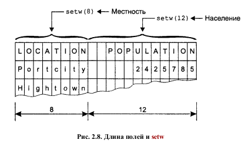

# Глава 1. ООП

**Процедурное программирование** -  программирование на императивном языке, при котором последовательно выполняемые операторы можно собрать в подпрограммы, то есть более крупные целостные единицы кода, с помощью механизмов самого языка.

Основополагающей идеей **объектно-ориентированного подхода** является объединение данных и действий, производимых над этими данными, в единое целое, которое называется объектом. Прямой доступ к данным невозможен. Данные сокрыты от внешнего воздействия, что защищает их от случайного изменения. Говорят, что данные и методы инкапсулированы. Термины сокрытие и инкапсуляция данных являются ключевыми в описании объектно-ориентированных языков.

**Наследование** - свойство в ООП позволяющее содавать *производные* классы на основе *базовых*.

Использование операций и функций различным образом в зависимости от того, с какими типами величин они работают, называется **полиморфизмом**. Когда существующая операция, например = или +, наделяется возможностью совершать действия над операндами нового типа, говорят, что такая операция является **перегруженной**. **Перегрузка** представляет собой частный случай полиморфизма и является важным инструментом ООП.

# Глава 2. Основы С++.

## Функции

Пример функции 
```cpp
#include <iostream> 
using namespace std;

int main() {
	cout << "Вывод какой-то информации"; # Производит вывод информации на экран
	return 0;
}
```
Main - основная функция. Слово int, предваряющее имя функции, указывает на то, что эта функция возвращает значение типа int. Тело функции заключено в фигурные скобки. 
Идентификатор cout на самом деле является объектом C++, предназначенным для работы со стандартным потоком вывода. Поток — это некоторая абстракция, отражающая перемещение данных от источника к приемнику.
Операция << называется операцией вставки. Она копирует содержимое пе- ременной, стоящей в правой ее части, в объект, содержащийся в левой ее части.

**Директива препроцессора** - первая строка, которая является указанием компилятору. Директива #include указывает препроцессору включить в компилируемый файл содержимое другого файла. Файл, включаемый с помощью директивы #include, обычно называют **заголовочным файлом**.

**Пространством имен** называется область программы, в которой распознается определенная совокупность имен. Эти имена неизвестны за пределами данного пространства имен. Директива
```cpp
using namespace std;
```
означает, что все определенные ниже имена в программе будут относиться к пространству имен с именем std.

# Типы данных

Переменные целого типа:
	1. **int** - переменная целого типа. Размер переменной равен 4 байтам. значение от -2 147 483 648 до 2 147 483 647..
	1. **long** - также переменная целого типа имеющая размер 4 байта.
	1. **short** - переменная целого типа имеющая размер 2 байта и принимающая значения от -32 768 до -32 767.
	Многие компиляторы позволяют определять целые типы с указанием нужной разрядности (в битах). Имена таких типов начинаются с двойного символа подчеркивания: \__int8, \__int16, \__int32, \__int64. Тип \__int8 соответствует типу char, типы \__int16 и \__int32 — соответственно типу short и паре типов int и long (справедливо как минимум для 32-разрядных систем). Тип \__int64 используется для хранения больших целых чисел разрядностью до 19 десятичных знаков.

Символьные переменные:
	1. **char** - символьная константа. Записывается в одинарных кавычках. Размер памяти для переменной равен 1 байту.

Вещественные типы:
	1. **float** - вещественная переменная размером 4 байта, принимающая значения от -3.4\*10^38 до 3.4\*10^38 с точностью до 7 знаков после запятой.
	1. **double** - вещественная переменная размером 8 байт.
	1. **long double** - вещественная переменная, размер которой зависит от компилятора, в основном 8 байт.

вещественные константы:
```cpp
	const float PI = 3.14159F;
```
Число 3.14159F является примером вещественной константы. Наличие десятичной точки говорит о том, что тип этой константы вещественный, а не целый, а суффикс F после значения константы указывает конкретны ее тип — **float**. Форма представления значения константы — нормализованна десятичная. Если вы определяете вещественную константу типа **double**, то суффикс D не обязателен — он является суффиксом по умолчанию. Для констант типа **long double** необходимо указывать суффикс L.

Для задания значений вещественных констант наряду с десятичной может также использоваться экспоненциальная форма записи. Например, число 1 000 000 000 можно записать в виде 1.0E9.

Ключевое слово const предшествует описанию типа переменной и означает, что во время выполнения программы запрещено изменять значение этой переменной. Любая попытка изменить значение переменной, описанной с таким префиксом, приведет к выдаче компилятором сообщения об ошибке.

Тип BOOL:
	1. **bool** - тип данных, который может иметь всего два значения — true и false. Размер 1 байт.

## Оператор вывода ввода.

Оператор вывода **cout << "строка" << Переменная;**
**endl** производит перевод строки.

Оператор ввода **cin >> ftemp;** заставляет программу ожидать ввода числа от пользователя. Введенное значение присваивается переменной ftemp.

В рамках второго из операторов cout в программе fahren операция << повторяется несколько раз, или каскадируется. Такая конструкция является вполне законной, потому что в этом случае операция << сначала посылает в переменную cout строку "Температура по Цельсию равна ", затем значение переменной ctemp, и наконец, символ перехода на новую строку '\n'. Операцию извлечения >> можно каскадировать совместно с cin аналогичным путем, давая возможность пользователю вводить несколько значений подряд. Однако такой подход употребляется достаточно редко, поскольку в этом случае перед вводом значений на экран пользователю не будут выводиться соответствующие приглашения.

## Манипулятор setw
Манипулятор setw печатает число или строку, следующую за ним в потоке, в поле фиксированной длины n, где n — аргумент манипулятора setw(n).
Пример: 
```cpp
cout << setw(9) << "Город" << setw(12)
<< "Население" << endl
<< setw(9) << "Москва"
<< setw(12) << pop1 << endl
<< setw(9) << "Киров"
<< setw(12) << pop2 << endl
<< setw(9) << "Угрюмовка" << setw(12) << pop3 << endl;
```




