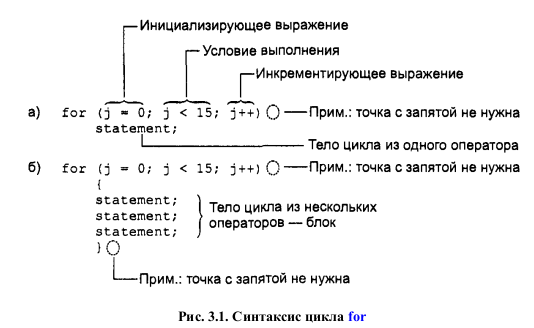
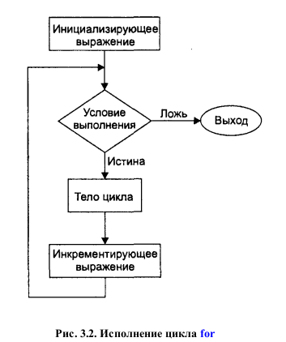

# Глава 3. Циклы и Ветвления
-----

## Операции отношения

| Операции	| Название	|
|-----------|-----------|
| >	| больше	|
| <	| меньше	|
| ==	| равно	|
| !=	| не равно	|
| >=	| больше или равно	|
| <=	| меньше или равно	|

## Циклы

### For

Пример цикла:
```cpp
// fordemo.cpp
// демонстрирует работу простейшего цикла for
#include <iostream>

using namespace std;

int main()
{
	int j; // определение счетчика цикла
	for(j = 0; j < 15; j++) {  // счетчик меняется от 0 до 14
		cout << j * j << " "; // квадрат значения j выводится на экран
	}
	cout << endl;
	return 0;
}
```






Тело цикла, заключенное в фигурные скобки, называется блоком. Важной особенностью блока является то, что переменные, определенные внутри него, **невидимы вне этого блока**.

#### Несколько инициализирующих выражений и условий цикла

Вместо одного инициализирующего выражения в операторе цикла for можно использовать несколько выражений, разделяемых запятыми.

```cpp
for(j = 0, alpha = 100; j < 50; j++, beta--)
{
	// тело цикла
}
```

Из трех выражений, используемых при задании цикла, на самом деле ни одно не является обязательным. Так, например, конструкция ``for(; ;)`` эквивалентна циклу while с условием продолжения, равным true.


