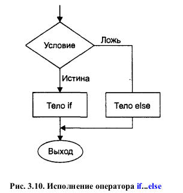

# Глава 3. Циклы и Ветвления
-----

## Операции отношения

| Операции	| Название	|
|-----------|-----------|
| >	| больше	|
| <	| меньше	|
| ==	| равно	|
| !=	| не равно	|
| >=	| больше или равно	|
| <=	| меньше или равно	|

## Циклы

### For

Пример цикла:
```cpp
// fordemo.cpp
// демонстрирует работу простейшего цикла for
#include <iostream>

using namespace std;

int main()
{
	int j; // определение счетчика цикла
	for(j = 0; j < 15; j++) {  // счетчик меняется от 0 до 14
		cout << j * j << " "; // квадрат значения j выводится на экран
	}
	cout << endl;
	return 0;
}
```


Тело цикла, заключенное в фигурные скобки, называется блоком. Важной особенностью блока является то, что переменные, определенные внутри него, **невидимы вне этого блока**.

#### Несколько инициализирующих выражений и условий цикла

Вместо одного инициализирующего выражения в операторе цикла for можно использовать несколько выражений, разделяемых запятыми.

```cpp
for(j = 0, alpha = 100; j < 50; j++, beta--)
{
	// тело цикла
}
```

Из трех выражений, используемых при задании цикла, на самом деле ни одно не является обязательным. Так, например, конструкция ``for(; ;)`` эквивалентна циклу while с условием продолжения, равным true.

### While

Пример цикла:
```cpp
// endon0.cpp
// применение цикла WHILE
#include <iostream>
using namespace std;
int main()
{
	int n = 99;
	// n не должна быть равна 0 перед началом цикла
	while(n != 0) {
		cin >> n;	
	}
	cout << endl;
	// цикл, пока значение n не равно 0
	// считывание n с клавиатуры
	return 0;
}
```


### Do

Цикл:
```cpp
// divdo.cpp
// применение цикла do
#include <iostream>
using namespace std;
int main()
{
	long dividend, divisor;
	char ch;
	do	{ // начало цикла do
	// действия
		cout << "Введите делимое: "; cin >> dividend;
		cout << "Введите делитель: "; cin >> divisor;
		cout << "Частное равно " << dividend / divisor;
		cout << ", остаток равен " << dividend % divisor;
		cout << "\nЕще раз?(y/n): ";
		cin >> ch;
	}
	while(ch != 'n'); // условие цикла
	return 0;
}
```


### Выбор типа цикла

Цикл for подходитдля тех случаев, когда мы заранее знаем, сколько раз нам потребуется его выполнение. Циклы while и do используются в тех случаях, когда число итераций цикла заранее не известно, причем цикл while подходит в тех случаях, когда тело цикла может быть не исполненным ни разу, а цикл do — когда обязательно хотя бы однократное исполнение тела цикла.

## Ветвления 

### IF

```cpp
// prime.cpp
// применение цикла if для определения простых чисел
#include <iostream>
using namespace std;
#include <process.h> 				// для exit()
int main()
{
	unsigned long n, j;
	cout << "Введите число: ";
	cin >> n; 						// ввод проверяемого числа
	for(j = 2; j <= n / 2; j++) 	// деление на целые числа,
	if(n % j == 0) 					// начиная с 2; если остаток
	{ 								// нулевой, то число не простое
		cout << "Число не простое: делится на " << j << endl;
		exit(0); 					// выход из программы
	}
	cout << "Число является простым\n";
	return 0;
}
```
Также если условий много можно использовать конструкцию ``else if() {};``


Можно помещать ветвления внутрь цикла и наоборот, использовать вложенные ветвления и вложенные циклы.

Библиотечная функция **exit(0)** производит немедленный выход из программы независимо от того, в каком месте она находится. Эта функция не возвращает значения. Ее единственный аргумент (в нашем случае 0) возвращается вызывающему окружению после того, как программа завершается.




### Функция getche()

```cpp
// chcount.cpp
// подсчет числа слов и символов в строке
#include <iostream>
using namespace std;
#include <conio.h>
// для getche()
int main()
{
	int chcount = 0;	// число непробельных символов
	int wdcount = 1;	// число пробелов
	char ch = 'a';		// ch должна иметь определенное значение
	cout << "Введите строку: ";
	while(ch != '\r')	// цикл, пока не будет нажата клавиша Enter
	{
		ch = getche();	// считывание символа
		if(ch == ' ')	// если символ является пробелом,
			wdcount++;	// то инкрементируем число слов
		else			// в противном случае
			chcount++;	// инкрементируем число символов
	}					// вывод результатов на экран
	cout << "\nCлов: " << wdcount << endl;
	cout << "Букв: " << (chcount - 1) << endl;
	return 0;
}
```

В данном случае программе необходимо обрабатывать каждый введенный символ сразу после его появления, не дожидаясь нажатия клавиши Enter. Такую возможность обеспечивает библиотечная функция getche(). Эта функция не имеет аргументов, а ее описание содержится в заголовочном файле CONIO.H. Значение, возвращаемое функцией getche(), присваивается переменной ch (функция getche(), кроме возвращения значения, печатает это значение на экране; такой ввод называется ввод с эхом (echo), что отражено в названии функции буквой е на конце. Другая функция под названием getch() похожа на функцию getche(), но, в отличие от нее, не отображает вводимый символ на экране.

#### Условия с присваиванием

```cpp
// chcnt2.cpp
// подсчет числа слов и символов в строке
#include <iostream>
using namespace std;
#include <conio.h>
// для getche()
int main()
{
int chcount = 0;
int wdcount = 1;					// пробел между двумя словами
char ch;
while((ch = getche()) != '\r') 		// цикл, пока не нажата клавиша Enter
{
	if(ch == ' ')					// если введен пробел,
		wdcount++;					// инкрементировать счетчик слов
	else							// иначе
		chcount++;					// инкрементировать число символов
}									// вывод результатов
cout << "\nСлов: " << wdcount << endl;
cout << "Букв: " << chcount << endl;
return 0;
}
```

Значение, возвращаемое функцией getche(), присваивается переменной ch, как и раньше, но сама операция присваивания находится прямо внутри условия цикла while. Присвоенное значение сравнивается с '\r' для того, чтобы выяснить, продолжать выполнение цикла или нет.
Таким образом, оператор while в программе CHCNT2 выполняет много полезных действий. Он не только проверяет, является ли значение переменной ch символом '\r', но еще получает символ с клавиатуры и присваивает его переменной ch.

#### Оператор switch

Если в программе присутствует большое дерево ветвлений и все ветвления зависят от значения какой-либо одной переменной, то можно вместо ступенчатой последовательности конструкций if...else или else...if воспользоваться оператором switch. Рассмотрим простой пример:
```cpp
// platters.cpp
// применение ветвления switch
#include <iostream>
using namespace std;
int main()
{
	int speed;		// скорость вращения грампластинки
	cout << "\nВведите число 33, 45 или 78: ";
	cin >> speed;	// ввод скорости пользователем
	switch(speed)	// действия, зависящие от выбора скорости
	{
		case 33:	// если пользователь ввел 33
		cout << "Долгоиграющий формат\n";
		break;
		case 45:	// если пользователь ввел 45
		cout << "Формат сингла\n";
		break;
		case 78:	// если пользователь ввел 78
		cout << "Устаревший формат\n";
		break;
	}
	return 0;
}
```

В switch() можно также передавать символьные переменные. Например 
```cpp
dir = getche();		// ввод переменной
switch(dir)			// switch c переменнной dir
```

Можно использовать в switch только целые и символьные типы, но нельзя использовать вещественные.

### Оператор break

Оператор break завершает выполнение ближайшего включающего цикла или условного оператора, в котором он отображается. Управление передается оператору, который расположен после оператора, при его наличии.


Ещё пример для цикла for:
```cpp
#include <iostream>
using namespace std;

int main()
{
    // An example of a standard for loop
    for (int i = 1; i < 10; i++)
    {
        if (i == 4) {
            break;
        }
        cout << i << '\n';
    }

    // An example of a range-based for loop
int nums []{1, 2, 3, 4, 5, 6, 7, 8, 9, 10};

    for (int i : nums) {
        if (i == 4) {
            break;
        }
        cout << i << '\n';
    }
}
```


