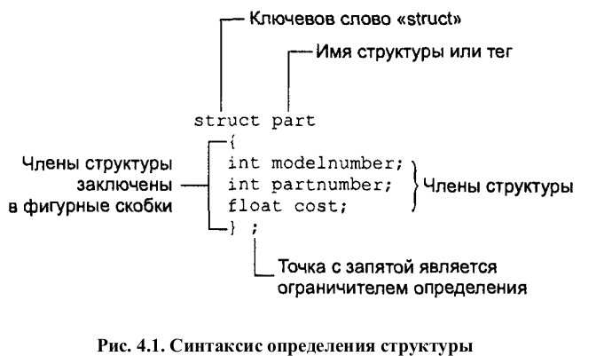
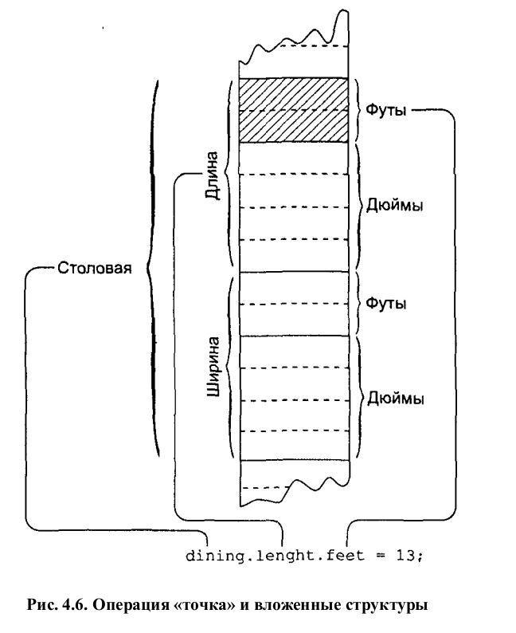

# Глава 4. Структуры и перечисления

## Структуры

Структуры это объединение простых переменных. Переменные, входящие в состав структуры, называются полями структуры.
На практике отличие структуры от класса заключается в следующем: структуры, как правило, используют в качестве объединения данных, а классы — в качестве объединения данных и функций.

Пример программы с простой структурой:
```cpp
// parts.cpp
// структура для хранения информации о деталях изделий
#include <iostream>
using namespace std;

struct part 				// объявление структуры
{
int modelnumber;			// номер модели изделия
int partnumber;				// номер детали
float cost;					// стоимость детали
};

int main()
{
part part1;					// определение структурной переменной
part1.modelnumber = 6244; 	// инициализация полей
part1.partnumber = 373;
// переменной part1
part1.cost = 217.55F;		// вывод значений полей на экран
cout << "Модель " << part1.modelnumber;
cout << ", деталь " << part1.partnumber;
cout << ", стоимость $" << part1.cost << endl;
return 0;
}
```



Определение структуры part необходимо для того, чтобы создавать на его основе переменные типа part. Само определение не создает никаких переменных; другими словами, не происходит ни выделения физической памяти, ни объявления переменной. В то же время определение обычной переменной предполагает выделение памяти под эту переменную. Таким образом, определение структуры фактически задает внутреннюю организацию структурных переменных после того, как они будут определены.

Под структурную переменную всегда отводится столько памяти, сколько достаточно для хранения всех ее полей.

Структуры идентифицируется с помощью трех составляющих: имени структурной переменной, операции точки (.) и имени поля.

Переменные также могут инициализироваться следующим образом
```cpp
part part1 = { 6244, 373, 217.55F };
```
Можно также присваивать значение одной структурной переменной другой структурной переменной:
```cpp
part part2;
part2 = part1;
```

Структуры допускают вложенность, то есть использование структурной переменной в качестве поля какой-либо другой структуры. Пример программы с вложенной структурой:
```cpp
// englarea.cpp
// использование вложенных структур
#include <iostream>
using namespace std;

struct Distance		// длина в английской системе
{	
int feet;			// футы
float inches;		// дюймы
};

struct Room			// размеры прямоугольной комнаты
{
Distance length;	// длина
Distance width;		// ширина
};

int main()
{
Room dining;												// переменная dining типа Room
dining.length.feet = 13; 									// задание параметров комнаты
dining.length.inches = 6.5;
dining.width.feet = 10;
dining.width.inches = 0.0;									
// преобразование длины и ширины в вещественный формат
float l = dining.length.feet + dining.length.inches / 12;
float w = dining.width.feet + dining.width.inches / 12;		
// вычисление площади комнаты и вывод на экран
cout << "Площадь комнаты равна " << l * w
<< " квадратных футов\n";
return 0;
}
```



Инициализация вложенных структур может происходить следующим образом:
```cpp
Room dining = { {13, 6.5}, {10, 0.0} };
```

## Перечисления

Перечисления используются в тех случаях, когда переменные создаваемого типа могут принимать заранее известное конечное (и, как правило, небольшое) множество значений.
Пример:
```cpp
// dayenum.cpp
// применение перечислений
#include <iostream>
using namespace std;
// объявление перечисляемого типа
enum days_of_week { Sun, Mon, Tue, Wed, Thu, Fri, Sat };
int main()
{
days_of_week day1, day2;	// определения переменных, хранящих дни недели
day1 = Mon; 				// инициализация переменных
day2 = Thu;
int diff = day2 - day1;		// арифметическая операция
cout << "Разница в днях: " << diff << endl;
if(day1 < day2)
// сравнение
cout << "day1 наступит раньше, чем day2\n";
return 0;
}
```
вывод будет следующим:
``Разница в днях: 3
day1 наступит раньше, чем day2``

Первой из перечисляемых констант соответствует целое значение, равное 0, второй — значение, равное 1, и т. д. Для того чтобы изменить значение, с которого начинается нумерация, можно с помощью операции присваивания задать это значение первой из перечисляемых констант:
`enum Suit { clubs = 1, diamonds, hearts, spades };`

Важным недостатком перечисляемых типов данных является то, что они не распознаются средствами ввода/вывода C++. Например, результатом вывода в фрагменте

