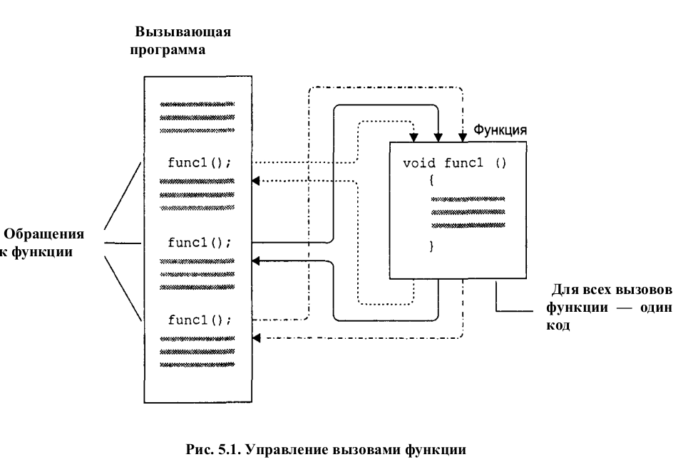
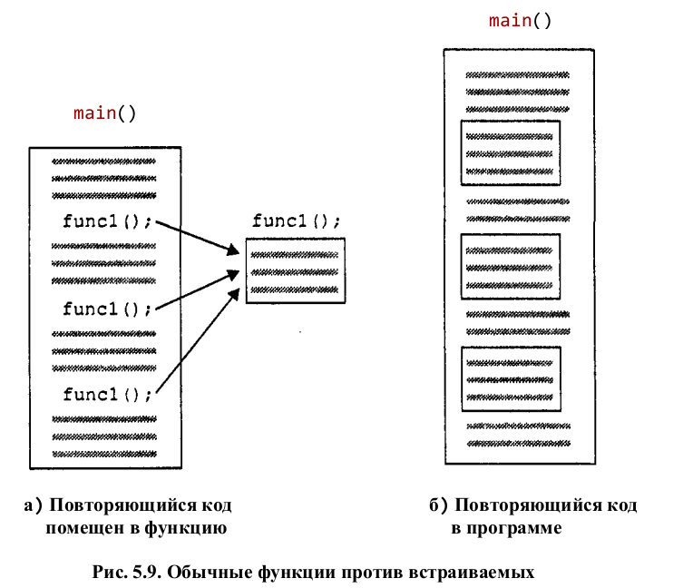

# Функции

Функция представляет собой именованное объединение группы операторов. Это объединение может быть вызвано из других частей программы.



Привер использования функции: 
```cpp
// table.cpp
// demonstrates simple function
#include <iostream>

using namespace std;

void starline();// объявление функции (прототип)

int main()
{
	starline(); 	// вызов функции
	cout << "Тип данных Диапазон" << endl;
	starline(); 	// вызов функции
	cout << "char
	-128...127" << endl
	<< "short
	-32 768...32 767" << endl
	<< "int
	Системно-зависимый" << endl
	<< "long -2 147 483 648...2 147 483 647" << endl;
	starline(); 	// вызов функции
	return 0;
}

void starline() 	// заголовок функции
{
	for(int j = 0; j < 45; j++)		// тело функции
	cout << '*';
	cout << endl;
}
```

Объявление функции означает, что где-то ниже в листинге программы будет содержаться код этой функции. Ключевое слово *void* указывает на то, что функция не возвращает значения, а пустые скобки говорят об отсутствии у функции передаваемых аргументов (для того чтобы явно показать отсутствие аргументов у функции, вы можете поместить внутрь скобок слово *void*; такая практика часто применяется в языке C, однако в C++ чаще оставляют скобки пустыми).
Функция *starline()* трижды вызывается из функции main().
Определение содержит код функции.

Вторым способом вставить свою функцию в программу является ее определение, помещенное ранее первого ее вызова. В этом случае прототип функции не используется.

## Передача аргументов в функцию

Аргументом называют единицу данных (например, переменную типа int), передаваемую программой в функцию. Аргументы позволяют функции оперировать различными значениями или выполнять различные действия в зависимости от переданных ей значений.

Структурные переменные могут использоваться в качестве аргументов функций. Мы продемонстрируем два примера, в одном из которых участвует уже знакомая нам структура Distance, а другой пример будет работать с графическим объектом.

Например: 
```cpp
#include <iostream>
using namespace std;

struct Distance 	// длина в английской системе
{
	int feet;
	float inches;
}

void engldisp(Distance dd) // параметр dd типа Distance
{
	cout << dd.feet << "\'-" << dd.inches << "\"";
}

int main()
{
	Distance d1, d2; // определение двух длин
					// ввод значений полей d1
	cout << "Введите число футов: "; cin >> d1.feet;
	cout << "Введите число дюймов: "; cin >> d1.inches;	 // ввод значений полей d2
	cout << "\nВведите число футов: "; cin >> d2.feet;
	cout << "Введите число дюймов: "; cin >> d2.inches;
	cout << "\nd1 = ";
	engldisp(d1); 	// вывод значения d1
	cout << "\nd2 = ";
	engldisp(d2);	// вывод значения d2
	cout << endl;
	return 0;
}
```

### Аргументы по умолчанию

Можно организовать функцию, имеющую аргументы, таким образом, что ее можно будет вызывать, вообще не указывая при этом никаких аргументов. Однако для этого при объявлении функции необходимо задать значения аргументов по умолчанию.

## Значение, возвращаемое функцией

Когда выполнение функции завершается, она может возвратить значение программе, которая ее вызвала. Как правило, возвращаемое функцией значение имеет отношение к решению задачи, возложенной на эту функцию.

Тип возвращаемого значения указывается перед именем функции при объявлении и определении функции.

Всегда следует указывать тип значения, возвращаемого функцией. Если ваша функция не возвращает значения, то вместо типа возвращаемого значения должно присутствовать ключевое слово void.

Оператор `return` возвращает значение, полученное в результате выполнения функции.

В программах можно также исключать ненужные переменны и использовать функции вместо них. Например:
``cout << "Вес в килограммах равен " << lbstokg(lbs) << endl;``

В качестве возвращаемого значения может быть также структурная переменная.

## Ссылки на аргументы

Ссылка является псевдонимом, или альтернативным именем переменной. Одним из наиболее важных применений ссылок является передача аргументов в функции.
При помощи знака *& (амперсанда)* можно передавать переменную функцию в качестве аргумента. Например:
```cpp
// ref.cpp
// применение ссылочного механизма передачи аргументов
#include <iostream>
using namespace std;
int main()
{
	void intfrac(float, float&, float&);			// прототип
	float number, intpart, fracpart;
	do {
		cout << "\nВведите вещественное число:";
		cin >> number;								// ввод числа пользователем
		intfrac(number, intpart, fracpart);			// нахождение целой и дробной части
		cout << "Целая часть равна " << intpart		// вывод результатов
		<< ", дробная часть равна " << fracpart << endl;
	} while(number != 0.0);							// выход из цикла, если введен ноль
	return 0;
}

// функция intfrac()
// вычисляет целую и дробную часть вещественного числа
void intfrac(float n, float& intp, float& fracp)
{
	long temp = static_cast<long>(n);	// преобразование к типу long,
	intp = static_cast<float>(temp);	// и обратно во float
	fracp = n - intp;					// вычитаем целую часть
}
```
Другими словами, используя имя *intp* в функции *intfrac()*, фактически мы оперируем значением переменной *intpart* функции *main()*. Знак *& (амперсанд)* символизирует ссылку, поэтому запись `float& intp` означает, что *intp* является ссылкой на переменную типа float. Точно так же *fracp* является ссылкой на переменную типа float, в нашем случае — на переменную *fracpart*.

Ссылочный механизм напоминает устройство дистанционного управления: вызывающая программа указывает функции переменные, которые нужно обработать, а функция обрабатывает эти переменные, даже не зная их настоящих имен.

В языке C не существует понятия ссылка. Схожие с ссылками возможности в С обеспечивают указатели, хотя зачастую их применение менее удобно. Создание ссылочного механизма в C++ было обусловлено стремлением обеспечить гибкость языка в ситуациях, связанных с использованием как объектов, так и простых переменных.

## Перегруженные функции

Перегруженная функция выполняет различные действия, зависящие от типов данных, передаваемых ей в качестве аргументов.
Для того чтобы написать перегруженную функцию необходимо написать несколько функций с одинаковыми именами. Например при выполнении функции с переменным числом аргументов:
```cpp
void repchar()
{
	for(int j = 0; j < 45; j++) // цикл, выполняющийся 45 раз
		cout << '*';			// вывод символа '*'
	cout << endl;
}

void repchar(char ch)
{
	for(int j = 0; j < 45; j++) // цикл, выполняющийся 45 раз
		cout << ch;				// вывод заданного символа
	cout << endl;
}

void repchar(char ch, int n)
{
	for(int j = 0; j < n; j ++) // цикл, выполняющийся n раз
		cout << ch;				// вывод заданного символа
	cout << endl;
}
```
Также можно задавать различные типы аргументов, передаваемых в функцию.

## Рекурсия

Рекурсия позволяет функции вызывать саму себя на выполнение. Пример рекурсивной функции:
```cpp
unsigned long factfunc(unsigned long n)
{
	if(n > 1)
		return n * factfunc(n - 1);		// вызов самой себя
	else
		return 1;
}
```

## Встраиваемые функции

Встраиваемые функции могут использоваться для малых функций, когда вызов программы занимает в памяти больше место, чем постоянное повторение в коде программы. Принцип работы встраиваемой функции изображён на рисунке ниже:



Встраиваемая функция вызывается добавлением слова `inline`. Например:
```cpp
inline float lbstokg(float pounds)
{
	return 0.453592 * pounds;
}
```

## Область видимости и класс памяти

**Область видимости** определяет, из каких частей программы возможен доступ к переменной, а **класс памяти** — время, в течение которого переменная существует в памяти компьютера.
Переменные, имеющие локальную область видимости, доступны внутри того блока, в котором они определены. 
Переменные, имеющие область видимости файла, доступны из любого места файла, в котором они определены.
Блоком обычно считается код, заключенный в фигурные скобки. Например, тело функции представляет собой блок.

### Локальные переменные

Переменные, определяемые внутри функции, называют локальными, поскольку их область видимости ограничивается этой функцией. Локальная переменная не существует в памяти до тех пор, пока не будет вызвана функция, в которой она определена. Время жизни локальной переменной равно времени, проходящему с момента объявления переменной в теле функции до завершения исполнения функции. Переменные, определенные внутри функции, видимы, или доступны, только внутри функции, в которой они определены.

### Глобальные переменные

В отличие от локальных переменных, определяемых внутри функций, глобальные переменные определяются вне каких-либо функций. Глобальная переменная видима из всех функций данного файла и, потенциально, из других файлов. Говоря более точно, глобальная переменная видна из всех функций файла, которые определены позже, чем сама глобальная переменная.


### Статические локальные переменные

Статическая локальная переменная имеет такую же область видимости, как и автоматическая: функцию, к которой принадлежит данная переменная. Однако время жизни у статической локальной переменной иное: оно совпадает со временем жизни глобальной переменной, правда, с той разницей, что существование статической локальной переменной начинается при первом вызове функции, к которой она принадлежит.
Статические локальные переменные используются в тех случаях, когда необходимо сохранить значение переменной в памяти после того, как выполнение функции будет завершено, или, другими словами, между вызовами функций.

Инициализация статических локальных переменных происходит указанием `static` перед типом переменной. Например:
```cpp
float getavg(float newdata)
{
	static float total = 0; 	// инициализация статических
	static int count = 0;		// переменных при первом вызове
	count++;					// увеличение счетчика
	total += newdata;			// добавление нового значения к сумме
	return total / count;		// возврат нового среднего значения
}
```

### Класс памяти

|						| Локальная	| Статическая локальная	| Глобальная	|
|-----------------------|-----------|-----------------------|---------------|
| Область видимости		| Функция	| Функция				|  Программа	| 
| Время жизни			| Функция	| Программа				|  программа	| 
| Начальное значение	| Случайное	| 0 					| 0 			| 
| Область значимости	| Стек		|  Динамическая			|  Динамическая	| 
| Назначение			| Переменные, используемые отдельной функцией, уничтожающиеся при выходе из нее | Переменные, используемые отдельной функцией, но сохраняющие свои значения между вызовами функции | Переменные, используемые несколькими функциями |

## Возвращение значения по ссылке

Функция может возвращать значение глобальной переменной. Например:
```cpp
// retref.cpp
// возвращение значения по ссылке
#include <iostream>
using namespace std;
int x;							// глобальная переменная
int& setx();					// прототип функции
int main()
{								// присваивание значения x при
	setx() = 92;				// помощи вызова функции слева
	cout << "x =" << x << endl; // вывод нового значения x
	return 0;
}
//--------------------------------------------------------
int& setx()
{
	return x;					// возвращает значение, которое будет изменено
}
```
В результате работы программы на экран будет выведено `92`. В этой программе функция **setx()**, согласно своему прототипу, имеет тип возвращаемого значения **int&**. Внутри функции содержится оператор **return**,где переменная **x** была определена как глобальная.
Если попытаться передать оператору return в такой функции константу, или сделать следующим образом:
```cpp
int& setx()
{
	int x = 3;
	return x;
}
```
То компилятор выдаст ошибку.

## Константные аргументы функции

Ссылочный механизм можно также использовать для улучшения эффективности работы программы. При передачи аргументов, занимающих много места в памяти, в функцию его передача по ссылке является гораздо более эффективной, поскольку в последнем случае в функцию передается не значение переменной, а только ее адрес. Но при этом порой является необходимым защитить передаваемый аргумент от изменений.
Для того чтобы получить подобную гарантию, вы можете указать модификатор const перед соответствующим аргументом в прототипе функции. Например:
`void aFunc(int& a, const int& b)`


