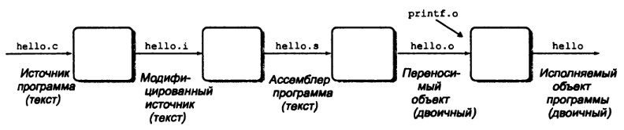
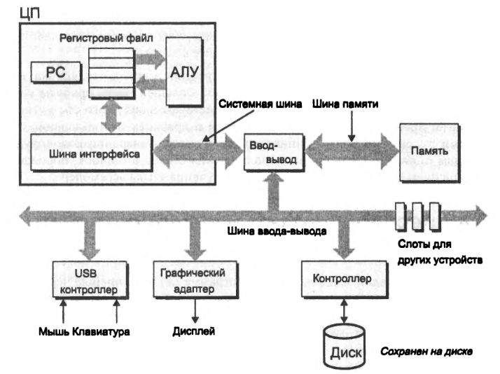
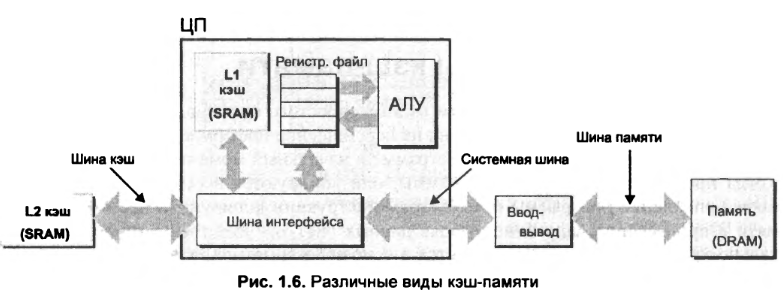
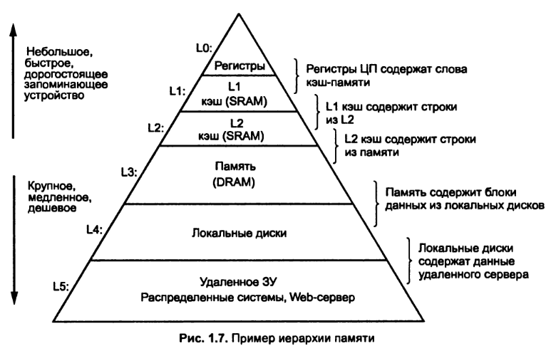
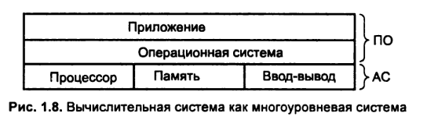
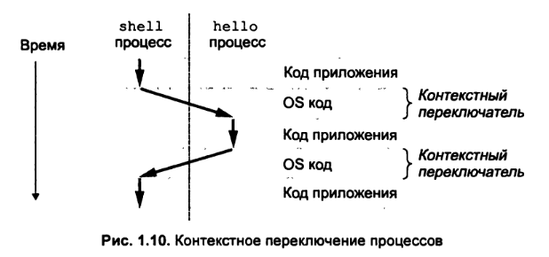
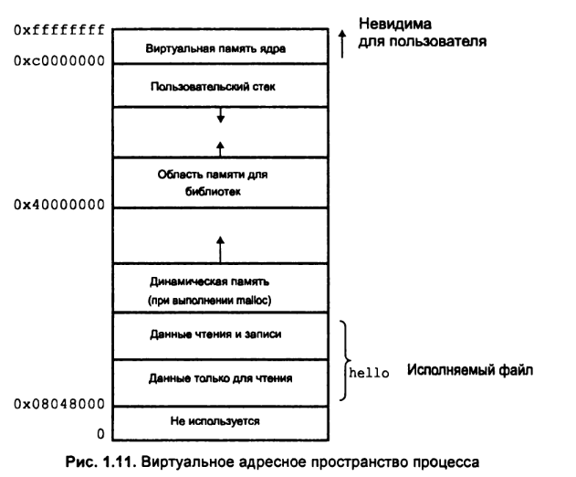

# Глава 1. Экскурс в компьютерные системы
---

## Информация — это биты + контекст
Большинство современных систем представляют текстовые символы в стандарте ASCII.
Вся информация системы, включая файлы на дисках, программы и данные пользователей, хранящиеся в памяти, а также данные, передаваемые по сети, представляются в виде некоторых порций. Единственное, что отличает различные виды данных друг от друга — контекст, в котором мы их рассматриваем.

## Программы, которые переводятся другими программами в различные формы
В операционной системе Unix преобразование исходного файла в объектный файл выполняется драйвером компилятора:
unix> gcc -о hello hello.с

Процес компиляции на примере программы hello.c
``` c
#include <stdio.h>

int main()
{
	printf("hello, world\n");
}
```
Компиляция происходит в 4 этапа:
1. Стадия препроцессора (предварительной обработки). Препроцессор (cpp) изменяет исходную программу в соответствии с директивами #include <stdio.h>.
1. Стадия компиляции. Компилятор (ccl) транслирует текстовый файл в текстовый файл hello.s, который содержит программу на языке ассемблера.
1. Стадия ассемблирования. Ассемблер (as) транслирует файл hello.s в инструкции машинного языка, упаковывает их в форму, известную как перемещаемая  объектная программа, и запоминает результат в объектном файле hello.о.
1. Стадия редактирования связей. Производит слияние программы с стандартными библиотеками С, в данном случае с функцией printf.



## Аппаратное устройство системы



- **Шины**. Совокупность электрических проводников, так называемых шин, по которым байты информации циркулируют между компонентами системы. Обычно шины конструируются таким образом, чтобы можно было передавать порции, содержащие фиксированное число байтов, получившие название слово. 
- **Устройства ввода вывода**. Устройства ввода-вывода представляют собой средства связи с внешним миром.
- **Оперативная память**. Временное запоминающее устройство, в котором временно хранятся как программа, так и данные, которыми она манипулирует во время выполнения. Физически основная память состоит из совокупности чипов динамических оперативных запоминающих устройств. В логическом плане основная память организована в виде линейной последовательности байтов, каждый из которых имеет свой собственный уникальный адрес (индекс элемента массива); отсчет адресов начинается с нуля.
- **Процессор**. инструкции, хранящиеся в основной памяти. Его ядро составляет устройство памяти размером в одно слово (или регистр), получившее название счетчик команд (PC). Он считывает из памяти инструкцию, указанную счетчиком команд, интерпретирует биты инструкции, выполняет простые операции, предписанные инструкцией, а затем обновляет значение счетчика, чтобы тот указывал адрес следующей инструкции.
Регистровый файл — небольшое запоминающее устройство, которое состоит из совокупности регистров размеров в одно слово, каждый из которых имеет свое уникальное имя. Устройство вычисляет новые значения данных и адресов. Примеры операций, которые процессор выполняет по требованию инструкции:
	- Загрузка. Скопировать байт или слово из основной памяти в регистр, затирая при этом предыдущее содержимое этого регистра.
	- Запоминание. Скопировать байт или слово из регистра в некоторую ячейку основной памяти, затирая при этом предыдущее содержимое этой ячейки.
	- Обновление данных. Скопировать содержимое двух регистров ALU, которое складывает эти два слова и запоминает результат в одном из регистров, затирая при этом предыдущее содержимое этого регистра.
	- Считывание ввода-вывода. Скопировать байт или слово из устройства ввода-вывода в регистр.
	- Запись ввода-вывода. Скопировать байт или слово из регистра в устройство ввода-вывода.
	- Переход. Извлечь слово из самой инструкции и скопировать это слово в счетчик команд, затирая предыдущее содержимое.

## КЭШ память


Время доступа к основной памяти в разы больше чем к регистровому файлу. Чтобы уменьшить разрыв между процессором и основной памятью, специалисты по проектированию систем используют небольшие быстродействующие устройства, получившие название кэш-память (или просто кэш) и служащие в качестве временных резервных областей для хранения информации. Кэш L1 на плате процессора содержит десятки тысяч байтов, доступ к ним осуществляется фактически так же быстро, как и к регистровому файлу. Еще больше кэш L2, содержащий от сотен тысяч до миллионов байтов, он соединен с процессором посредством специальной шины. Вычислительному процессу потребуется в 5 раз больше времени для доступа к L2, чем к L1, но это все же в 5—10 раз быстрее, чем доступ к основной памяти. L1 и L2 построены по технологии, известной как статические запоминающие устройства с произвольной выборкой (SRAM).

## Иерархия памяти



Основная идея иерархии памяти заключается в том, что память одного уровня служит кэш-памятью для следующего нижнего уровня. Таким образом регистровый файл— кэш для памяти уровня L1, которая является кэш-памятью для основной памяти, а та, в свою очередь, является кэш-памятью для диска. В некоторых сетевых системах с распределенной файловой системой локальный диск служит кэш-памятью для данных, хранящихся на дисках других систем.

## Операционная система

Мы можем представлять себе операционную систему как некоторый слой программного обеспечения между прикладной программой и аппаратными средствами.
Операционная система, прежде всего, должна отвечать двум следующим основным требованиям: защитить аппаратные средства от катастрофических действий вышедшей из-под контроля программы и снабжать приложения простыми и единообразными механизмами манипулирования сложными и часто крайне неоднородными низкоуровневыми аппаратными средствами.



### Процесс
Процесс есть абстракция выполняемой программы в рамках операционной системы.На одной и той же системе одновременно могут выполняться многие процессы, и вто же время создается впечатление, что каждый процесс пользуется исключительными правами на использование аппаратных средств. Под одновременным выполнением мы понимаем то, что инструкции одного процесса чередуются с инструкции другого процесса. Операционная система выполняет это чередование посредством механизма, известного как контекстное переключение.



### Поток

В современных системах процесс фактически может состоять из множества исполнительных элементов, именуемых потоками (или нитями), каждая нить выполняется в контексте процесса, использует совместно с процессом те же программные коды и глобальные данные.

### Виртуальная память

Виртуальная память есть абстракция, которая порождает в каждом процессе иллюзию, что лишь он один использует основную память. Каждый процесс имеет одно и то же представление о памяти, которое известно как его виртуальное адресное пространство.



Пространство виртуальных адресов с точки зрения процесса поделено на следующие области:
- Программные коды и данные. Программный код начинается с одного и того же адреса, за ним следуют ячейки памяти, соответствующие глобальным переменным языка. Области программных кодов и данных инициализируются непосредственно содержимым исполняемого объектного файла, в нашем случае это исполняемый файл hello. 
- Динамическая память. Непосредственно за программными кодами и данными следует область динамической памяти программы. В отличие от областей программных кодов и данных, размеры которых фиксируются, как только процесс начнет выполняться, динамическая память может расширяться и сокращаться размерах во время выполнения программы, как результат обращения к стандартной библиотеке программ, таких как malloc и free. Мы продолжим подробное изучение динамической памяти после того, как рассмотрим в главе 10 вопросы управления виртуальной памяти.
- Совместно используемые библиотеки. Примерно половина адресного пространства представляет собой область, в которой хранятся программные коды и данные для совместно используемых библиотек, таких как библиотека стандартных программ на С или библиотека математических программ. Понятие совместно используемой библиотеки является мощным, но в то же время несколько трудным понятием. Вы узнаете, как нужно с ними работать, когда мы приступим к изучению динамического связывания в главе 7.
- Стек. В верхней части виртуального адресного пространства находится стек пользователя, который используется компилятором для реализации вызовов функций.Как и динамическая память, стек пользователя может динамически расширяться и сокращаться в размерах во время исполнения программы, В частности, каждый раз, когда мы вызываем какую-либо функцию, размер стека возрастает. Каждый раз, когда мы возвращаемся из функции, он сокращается. В главе 3 вы узнаете, как компилятор использует стек.
- Виртуальная память ядра. Ядро есть часть операционной системы, которое постоянно находится в основной памяти. Верхняя четверть адресного пространства зарезервирована для ядра. Прикладным программам запрещено читать содержимое этой области и заносить в нее записи или непосредственно вызывать функции, записанные в кодах ядра.

### Файлы

Файл есть некоторая последовательность. Все операции ввода-вывода системы выполняются путем считывания и записи файлов посредством нескольких системных вызовов, известных как вводы-выводы системы Unix.

## Обмен данных в сетях

С точки зрения отдельной системы, сеть можно рассматривать как еще одно устройство ввода-вывода. Когда система копирует некоторую последовательность байтов из основной памяти в сетевой адаптер, потоки данных устремляются через сеть в другую машину, а не, скажем, в локальный накопитель немагнитных дисках. Аналогично, система может читать данные, отправленные с других машин, и копировать эти данные в свою основную память.

