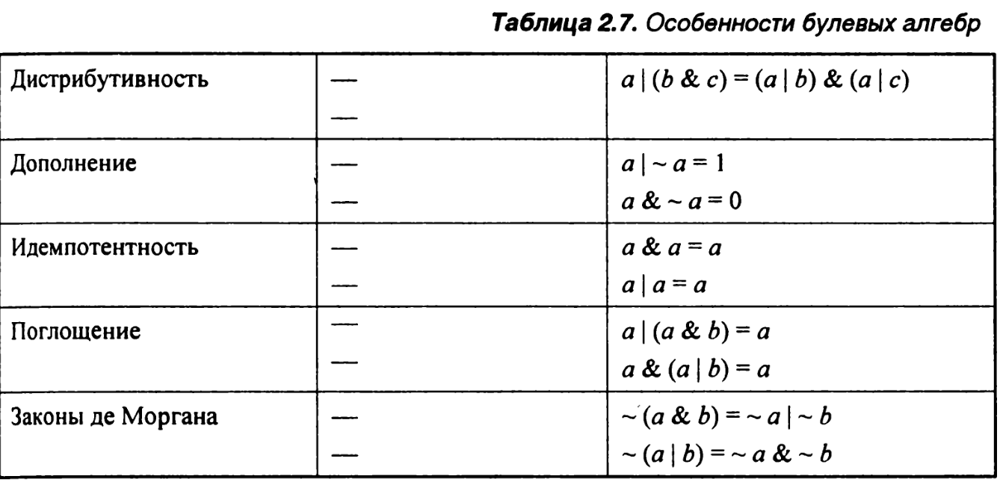

# Глава 2. Представление информации и работа с ней.
---

## Хранение информации

Вместо доступа к отдельным битам в памяти, в большинстве компьютеров в виде наименьших элементов памяти используются блоки по 8 битов — байты. Программа
машинного уровня рассматривает память как очень большой массив байтов, называемый виртуальной памятью. Каждый байт памяти имеет уникальный номер, называемый адресом, а множество всех возможных адресов называется виртуальным адресным пространством. Судя по названию, виртуальное адресное пространство.

Роль указателей в С:
	Подобно переменной, указатель имеет два параметра: величину и тип. Величина указывает на местоположение(ячейку) определенного объекта, а тип — на то, что за объект (например, целое число или число с плавающей точкой) сохранен в этой ячейке.

### Шеснадцатиричная система

Один байт состоит из восьми битов. В двоичной системе интервал его значений от 00000000 до 11111111. Для десятичного целого числа диапазон от 0 до 255. Двоичное представление слишком громоздкое, а для десятичного очень утомительно выполнять преобразования в битовые комбинации и обратно. Вместо всего этого битовые комбинации записываются как шестнадцатеричные числа. 

### Машинные слова

Каждый компьютер имеет длину машинного слова, указывающую номинальный размер целого и указателя. Самым важным системным параметром, определяемым длиной слова, является максимальный размер виртуального адресного пространства. То есть, для машины с длиной слова п битов диапазон виртуальных адресов может составлять от 0 до 2" - 1, обеспечивая программе доступ максимум к 2" байтов.

### Размеры данных

### Адресация и упорядочивание байтов

Переменная х типа int имеет адрес 0x100, т. е. значение адресного выражения &х— ОхЮО. Тогда четыре байта х будут сохранены в ячейках памяти 0x100, 0x101, 0x102 И 0x103.
В одних машинах объект сохраняется в памяти, упорядоченной от наименее значимого байта к наиболее значимому, а в других— наоборот. Первое правило — когда наименее значимый байт идет первым — называется правилом остроконечников. Этому правилу следует большинство машин бывшей Digital Equipment Corporation (теперь являющейся частью CompaqCorporation), а также Intel. Второе правило— когда наиболее значимый байт идет первым — называется правилом тупоконечников.

Вторым случаем, когда упорядочение байтов приобретает важность, является рассмотрение последовательностей байтов, представляющих целочисленные данные. Это часто имеет место при инспекции программ машинного уровня.

В третьем случае упорядочение байтов становится видимым, когда написанные программы, что называется, "обходят" систему нормального типа.

Функция printf (наряду со своими "сестрами" fprintf и sprintf) обеспечивает способ распечатки информации с тщательным контролем всех подробностей форматирования. Первое — это форматирующая строка, а все остальное — величины, которые необходимо напечатать. В рамках форматирующей строки каждая последовательность символов, начинающаяся с "%", указывает на то, как форматировать следующий аргумент. В набор типичных примеров входит "%d" для печати десятичного целого числа, "%f" — для печати числа с плавающей точкой и "%с" — для печати символа с кодом символа, представленным аргументом.

### Представление строк

Строка в С кодируется массивом символов, прерываемых нулем (нулевым символом). Каждый символ представлен некоей стандартной кодировкой, самой распространенной из которых является ASCII. Следовательно, если запустить процедуру show_bytes с аргументами "12345" и б (для включения символа прерывания), тогда в результате получится 31 32 33 34 35 00. Обратите внимание, что код ASCII для десятичного числа д: будет 0x3{число}, и что прерывающий байт имеет шестнадцатеричное представление 0x00.

### Булевая алгебра

Множество целых чисел, обозначенное символом Z, образует математическую структуру, называемую **кольцом**, обозначающимся как (Z, +, \*, -, 0, 1) со сложением, обозначенным операцией суммы, умножением — операции произведения, вычитанием — аддитивной инверсии, а элементами 0 и 1 — как идентификаторами сложения и умножения. Булева алгебра ({0,1}, |, &, \~, 0, 1) имеет сходные свойства.

### Побитовые операции 

Одной из полезных особенностей С является то, что он поддерживает побитовые булевы операции. На самом деле, символы, использованные для булевых операций, применяются и в С:
- \| — ИЛИ;
- & —И;
- \~ НЕ;
- ^ — Исключительное ИЛИ.

Одним из общих использований операций на уровне бита является реализация операций *маскирования*, где маской называется комбинация битов, указывающая на выбранное множество битов в слове.

### Логические операции

Язык С также представляет набор логических операторов | |, && и !, соответствующих операциям "ИЛИ", "И" и "НЕ" логики высказываний. Их легко спутать с операциями на уровне битов, однако они выполняют совершенно иные функции. Логические операции рассматривают любой ненулевой аргумент как истинный, а аргумент О как ложный. Они возвращают либо 1, либо 0, указывая либо на истинный, либо на ложный результат, соответственно. Вот несколько примеров оценки выражений:

### Операции сдвига в С

В С также представлен набор операций сдвига комбинаций битов влево и вправо. Для операнда х, имеющего битовое представление [x_{n-1}, x_{n-2}, ... , x_0] выражение х « к дает величину с битовым представлением [x_{n-k-1}, x_{n-k-2}, ..., x_0, 0, ..., 0].

Существует соответствующая операция сдвига вправо х » к, однако ее поведение имеет отличия. Логический сдвиг вправо заполняет левый край к нулями, выдавая результат [0, ..., 0, х_{n-1}, x_{n-2}, ..., x_k]. Арифметический сдвиг вправо заполняет левый край к повторениями наиболее значимого бита, выдавая результат [x_{n-1}, ... , x_{n-1}, x_{n-1}, x_{n-2}, ..., x_k].

## Целочисленное представление

В данном разделе описываются два разных способа того, как можно использовать биты для кодировки целых чисел: один из этих способов может представлять только неотрицательные числа, а другой — отрицательные числа, положительные и ноль.

### Типы целого

### Кодировки со знаком и с двоичным дополнительным кодом

При рассмотрении х как числа, написанного в двоичном счислении, получим интерпретацию х без знака. Эта интерпретация выражается как функция В2Uw (двоичного длины w до беззнакового):

Функция B2U_W преобразует строки нулей и единиц длины w в неотрицательные целые числа.
Наиболее широко распространенное компьютерное представление чисел со знаками называется формой дополнительного кода. Он определяется интерпретацией наиболее значимого бита слова, который будет иметь отрицательный вес. Подобная интерпретация выражается функцией B2T_W (двоичного длины w до дополнительного кода):

|Шесн 	| Двоич | B2U							| B2T 							|
|-------|-------|-------------------------------|-------------------------------|
| A 	| 1010	| 2^3 + 2^1 = 10 				| -2^3 + 2^1 = -6				|
| 0 	| 0000  | 0  							| 0 							|
| 3 	| 0011 	| 2^0 + 2^1 = 3 				| -2^0 - 2^1 = -3				|
| 8 	| 1000 	| 2^3 = 8 						| -2^3 = -8						|
| F 	| 1111 	| 2^3 + 2^2 + 2^1 + 2^0 = 15 	| -2^3 + 2^2 + 2^1 + 2^0 = -1	|

Для чисел со знаком существуют два других стандартных представления. 
**Обратный код**. То же самое, что и дополнительный код, за исключением того, что самый значимый бит имеет вес - (2^{w-1} - 1), а не -2^{w-1}.
**Величина знака**. Самый значимый бит — это двоичный разряд, определяющий то, какой вес должен быть определен остальным битам: положительный или отрицательный.

## Целочисленная арифметика

### Приращение без знака

Суммирование чисел производится по каждому биту 

| Двоичный формат		| Десятичный формат
|-----------------------|------------------
| 1001 + 0101 = 1110	| 9 + 5 = 14
| 			| 

  1001		9
+ 0101 	  + 5
  ----		-
  1110     14

При суммировании может произойти переполнение, если память выделенная на одно целое число меньше, чем память необходимая для сохранения суммы чисел. Например

  1001      9
+ 1010     10
  ----     --
  0011      3

Для двух целых чисел без знака можно судить о переполнении при помощи сравнения одного из числа с суммой. Если x + y = summ и summ <= x или summ <= y - то произошло переполнение.

При суммировании двух чисел с знаками можно получить отрицательное значение при суммировании положительных чисел, и положительное число при суммировании отрицательных чисел.

