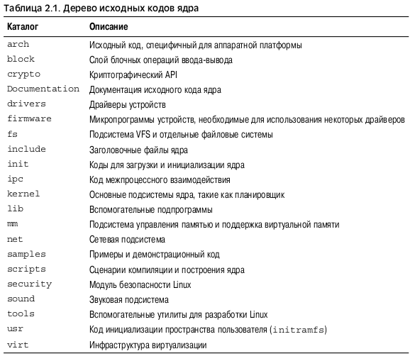

# Ядро Linux

**Ядро (supervisor)** - это внутренняя часть операционной системы. **Интерфейс пользователя** - внешняя часть. **Системные переменные
(system state)** и область памяти, в которой находится ядро, вместе называются **пространством ядра (kernel-space)**, или привилегированным режимом. Соответственно, **пользовательские программы** выполняются в **пространствах задач (user-space)**, или в пользовательском режиме.
Когда прикладная программа выполняет системный вызов, говорят, что ядро выполняет работу от имени прикладной программы. Более того, говорят, что прикладная программа выполняет системный вызов в пространстве ядра, а ядро выполняется в контексте процесса.

В операционной системе Linux процессор в любой момент времени выполняет один из трех перечисленных ниже типов действий:
1. Выполнение кода пользовательской программы в непривилегированном режиме.
1. Выполнение действий в контексте процесса в привилегированном режиме от имени определенного процесса.
1. Обработка прерывания в привилегированном режиме в контексте прерывания, не связанном с процессами.

## Отличие ядра Linux от Unix

1. Ядро Linux поддерживает динамическую загрузку модулей ядра. Хотя ядро Linux и является монолитным, оно может по необходимости динамически за грузить и выгрузить свой исполняемый код.
1. Ядро Linux поддерживает симметричную многопроцессорную обработку
(SMP). 
1. В ядре Linux поддерживается приоритетное планирование.
1. В ядре Linux используется интересный подход для поддержки многопоточности (threads): потоки ни чем не отличаются от обычных процессов. С точки зрения ядра все процессы одинаковы, просто некоторые из них имеют общие ресурсы.
1. В Linux принята объектно-ориентированная модель устройств, в которой поддерживаются классы устройств, события, возникающие при горячем подключении устройств, и файловая система в пространстве пользователя sysfs (user-space device filesystem).
1. В ядре Linux отсутствуют некоторые функции ОС Unix, которые разработчики посчитали плохо спроектированными, как, например, поддержка интерфейса STREAMS, или поддержка стандартов, которые невозможно аккуратно реализовать.
1. Ядро Linux является полностью открытым во всех смыслах этого слова.

## Обозначение версии Linux
2.6.30.1
| |  | |
| |  | |--- Номер стабильной версии
| |  |----- Номер выпуска
| |-------- Младшая версия ядра
|---------- Основная версия ядра

## Исходный код ядра

Может быть получен с помощью Git
git clone git://git.kernel.org/pub/scm/linux/kernel/git/torvalds/linux-2.6.git

## Отличие ядра от обычных программ

1. Ядро не имеет доступа к библиотеке функций и к стандартным заголовкам языка C.
1. Код ядра написан с использованием компилятора GNU С.
1. В ядре нет такой защиты памяти, как в режиме пользователя.
1. В ядре нельзя также просто использовать вычисления с плавающей точкой, как в пользовательских приложениях.
1. Ядро использует стек небольшого фиксированного размера для каждого процесса.
1. Поскольку обработка прерываний в ядре выполняется асинхронно, в нем реализован режим приоритетного планирования. Поддержка симметричной многопроцессорной обработки (SMP) привела к тому, что в ядре необходимо учитывать наличие параллелизма и использовать синхронизацию.
1. Переносимость кода ядра очень важна.

# Процес

Процесс — это программа (т.е. объектный код, хранящийся на какомлибо носителе информации), которая находится в состоянии выполнения.

В современных операционных системах процессы предусматривают наличие двух виртуальных ресурсов: **виртуального процессора и виртуальной памяти**. Благодаря виртуальному процессору для пользовательских процессов создается иллюзия, что они монопольно используют всю компьютерную систему, несмотря на то, что физическим процессором могут одновременно пользоваться десятки других процессов “Системный планировщик и диспетчеризация процессов”. Виртуальная память позволяет процессу распределять оперативную память компьютера и управлять ею так, как будто он один владеет всей памятью в системе.

Процесс, который вызвал функцию fork(), называется порождающим, или **родительским** (parent), а новый процесс именуют порожденным, или **дочерним** (child)

Семейство функций **exec()** позволяет создать новое адресное пространство и загрузить в него новую программу.
Функция **fork()** создаёт новый процес путём полного копирования уже существующего.
В конечном счете выход из программы осуществляется с помощью вызова системной функции **exit()**, которая завершает выполнение процесса и освобождает все занятые им ресурсы.
После завершения процесса он переводится в специальное состояние зомби (zombie), которое используется для представления завершенного процесса до того момента, пока порождающий его процесс не вызовет системную функцию **wait()** или **waitpid()**.

## Дескриптор процесса

Список процессов хранится в ядре в виде циклического двухсвязного списка, который называется списком задач (task list). Каждый элемент этого списка описывает один запущенный процесс и называется **дескриптором процесса**.

Дескриптор процесса имеет тип **task_struct**. Дескриптор процесса содержит всю информацию об определенном процессе.

Система идентифицирует процессы по значению **уникального идентификатора процесса** (process identification, **PID**).
Дефолтный максимальный PID - 32768, но его можно увеличить в `/proc/sys/kernel/pid_max`.

## Состояние процесса

1. **TASK_RUNNING**. Процесс готов к выполнению (runnable). Иными словами, процесс либо выполняется в данный момент, либо находится в очереди процессов, которые ожидают выполнения
1. **TASK_INTERRUPTIBLE**. Процесс приостановлен (находится в состоянии ожидания, sleeping), т.е. заморожен до наступления некоторого события.
1. **TASK_UNINTERRUPTIBLE**. Это состояние аналогично TASK_INTERRUPTIBLE, за исключением того, что процесс нельзя разморозить и перевести в исполняемое состояние с помощью специального сигнала.
1. **TASK_TRACED**. Выполняется трассировка процесса другим процессом, например отладчиком с помощью системной функции ptrace().
1. **TASK_STOPPED**. Выполнение процесса остановлено. Задача не выполняется и не имеет права выполняться. Такое может случиться, если задача получает

## Создание нового процесса

В системе Unix применяется довольно необычный подход, при котором указанные выше операции разделены на две самостоятельные функции: fork() и exec(). Первая функция — fork() — создает порожденный процесс, который является копией текущей задачи. Вторая функция — **exec()** — загружает исполняемый файл в адресное пространство процесса и передает ему управление.

В операционной системе Linux функция **fork()** реализована через вызов системной функции **clone()**. Ей передается в качестве аргументов набор флагов, определяющих, какие ресурсы должны быть общими (если нужно) у родительского и дочернего процессов. Основную массу работы по разветвлению процесса выполняет функция **do_fork()**, которая определена в файле kernel/fork.c. Эта функция, в свою очередь, вызывает функцию **copy_process()** и запускает новый процесс на выполнение.

Вызов системной функции **vfork()** позволяет получить тот же эффект, что и вызов функции **fork()**, за исключением того, что записи таблиц страниц родительского процесса не копируются.

## Реализация потоков в ядре Linux

Потоки позволяют реализовать режим одновременного выполнения программ (concurrent programming) и обеспечить истинный параллелизм на многопроцессорных системах.

С точки зрения ядра Linux не существует отдельной концепции потоков. В ядре Linux все потоки реализованы в виде стандартных процессов. Поток — это просто процесс, который использует некоторые ресурсы совместно с другими процессами. Каждый поток имеет свою структуру task_struct и с точки зрения ядра является обычным процессом, который совместно использует с другими процессами общие ресурсы, такие как адресное пространство.

В этих системах потоки — это абстракция, которая обеспечивает облегченные и более быстрые с точки зрения выполнения блоки кода, по сравнению с обычными тяжеловесными процессами.

Потоки создаются так же, как и обычные задачи, за исключением того, что системной функции **clone()** передаются флаги, указывающие на то, какие ресурсы должны использоваться совместно.

Часто требуется выполнить в ядре некоторые операции в фоновом режиме. В ядре такая возможность реализована в виде потоков ядра (kernel thread) — обычных процессов, которые выполняются исключительно в пространстве ядра.

`ps -ef` выводит список всех потоков ядра.

## Завершение процесса

Как правило, уничтожение процесса инициируется самим процессом. Это происходит, когда в самом процессе вызывается системная функция **exit()**. Причем это может произойти как явно, когда вся работа программы сделана и нужно завершить ее работу, так и неявно, при выполнении возврата из основной процедуры любой программы с именем **main()**. Другими словами, компилятор языка C помещает вызов функции **exit()** в код, который выполняется после возврата из процедуры **main()**.

После окончания работы функции **do_exit()** дескриптор завершившегося процесса все еще существует в системе, но сам процесс находится в состоянии зомби и не может выполняться. После того как родительский процесс получил информацию о завершенном дочернем процессе либо уведомил ядро, что эта информация ему больше не нужна, структура task_struct дочернего процесса освобождается.

## Дилемма “беспризорного” процесса

Если родительский процесс завершится до завершения всех его дочерних процессов, то должен существовать какой-нибудь механизм переназначения нового родительского процесса всем оставшимся дочерним процессам. Иначе “осиротевшие” процессы навсегда останутся в состоянии зомби и будут зря занимать системную память. Решение этой проблемы было указано выше: новым родительским процессом становится один из потоков группы завершившегося родительского процесса, или процесс init. Из функции **do_exit()** вызывается функция **exit_notify()**, которая в свою очередь вызывает функцию **forget_original_parent()**. Из последней функции вызывается еще одна функция **find_new_reaper()**, в которой и выполняется переназначение родительского процесса

# Системный планировщик и диспетчеризация процессов

*Системный планировщик* (process scheduler) — это компонент ядра, определяющий, какой из процессов должен выполняться, в какой именно момент и насколько долго.
Планировщик — основной компонент *мультипрограммных*, или, *многозадачных* (multitasking) операционных систем.
Чтобы использовать процессорное время наилучшим образом, один из готовых к выполнению процессов (runnable) должен всегда выполняться. Если количество готовых к выполнению процессов в системе превышает количество процессоров компьютера, то очевидно, что некоторые из этих процессов не будут выполняться в данный конкретный момент времени.

Мультипрограммные ОС бывают двух типов — с *кооперативной* (cooperative) и *приоритетной* (preemptive), или *вытесняемой*, многозадачностью. В Linux, как и во всех вариантах ОС Unix, а также в большинстве современных операционных систем реализован мультипрограммный режим работы с приоритетной многозадачностью. В приоритетных ОС возможно принудительное прерывание программы в зависимости от приоритета и времени выполнения процесса. В кооперативной ОС выполнение процесса не прерывается.

## Стратегии планирования

Виды процессов:
- Процессы ориентированные на *ввод-вывод (I/O-bound)*. Например приложения направленные на работу с графическим интерфейсом.
- Интенсивно использующие центральный процессор *(processor-bound)*. Например Matlab или sshkeygen.
- Процессы совмещающие в себе оба типа поведения.

Стратегия планирования операционной системы должна стремиться к удовлетворению двух несовместимых условий: обеспечения высокой скорости реакции процессов (т.е. малого времени отклика системы) и максимального использования системных ресурсов (т.е. высокой производительности).

### Приоритет процессов

Самым распространенным типом алгоритмов планирования является планирование *на основе приоритетов (priority-based)*. Основная идея, которая не совсем точно реализована в Linux, состоит в том, что процессы с более высоким приоритетом должны выполняться раньше тех, которые имеют более низкий приоритет, в то время как процессы с одинаковым приоритетом планируются на выполнение *по кругу (round-robin)*.

В ядре Linux используются два разных диапазона приоритетов. 
- Первый из них определяет значение параметра **nice** — число в диапазоне от –20 до +19, стандартное значение которого равно нулю. Большему значению параметра **nice** соответствует меньший приоритет. Процессам с низким значением параметра **nice** (большим приоритетом) выделяется большая часть процессорного времени.
- Второй диапазон соответствует приоритетам *реального времени (real-time priority)*. Диапазон этих значений можно изменить, однако по умолчанию он охватывает числа от 0 до 99 включительно. Большим значениям приоритета реального времени соответствует и больший приоритет.

Чтобы увидеть список процессов в системе и соответствующие им значения приоритета реального времени (в колонке RTPRIO), воспользуйтесь приведенной ниже командой:
`ps -eo state,uid,pid,ppid,rtprio,time,comm`

### Кванты времени
*Квант времени (timeslice)* — это числовое значение, определяющее, как долго может выполняться процесс до того момента, пока он не будет вытеснен. В стратегии планирования должно устанавливаться стандартное значение кванта времени. Слишком большое значение кванта времени приведет к ухудшению интерактивной производительности системы. При этом теряется ощущение, что процессы выполняются одновременно. Слишком малое значение кванта времени приведет к возрастанию накладных расходов на переключение между процессами.

В планировщике CFS системы Linux значения квантов времени напрямую не назначаются процессам. Вместо этого выделяется *доля (proportion) процессорного времени*. Процессам с большим значением параметра nice (меньшим приоритетом) назначается малый вес, что приводит к выделению небольшой порции процессорного времени. Процессам с меньшим значением параметра nice (большим приоритетом) назначается большой вес, что приводит к выделению большей порции процессорного времени

## Алгоритм работы планировщика Linux
Планировщик системы Linux имеет модульную конструкцию, что позволяет применять различные алгоритмы для планирования разных типов процессов. Этот модульный принцип построения называется *классами планировщика (scheduler classes)*. Каждый класс планировщика имеет свой приоритет.

В основу работы планировщика CFS положен простой принцип: моделирование планирования процессов таким образом, как если бы в системе был установлен идеальный и полностью многозадачный процессор. В подобных системах каждому процессу выделяется 1/n процессорного времени, где n — это количество готовых к выполнению процессов. При этом процессы запускаются на бесконечно малое время. В результате в течение произвольного периода времени планировщик должен запустить все n процессов, которые должны выполняться одинаковое количество времени. 

Таким образом, несмотря на то, что нужно стремиться запускать процессы на очень малое время, планировщик CFS еще должен учитывать возникающие при этом издержки и падение производительности из-за неэффективного использования кеш памяти процессора. Поэтому планировщик CFS запускает каждый процесс на некоторое время, а затем циклически выбирает следующий подходящий для запуска процесс. Вместо назначения каждому процессу определенного кванта времени планировщик CFS вычисляет длительность запуска процесса в зависимости от числа готовых к выполнению процессов. Вместо значения nice для вычисления значения кванта времени планировщик CFS использует это значение в качестве весового коэффициента, определяющее долю процессорного времени, выделяемого процессу. Затем каждому процессу назначается квант времени, пропорциональный его весу, деленный на общий вес всех готовых к выполнению процессов. 

Для вычисления значения реального кванта времени в планировщике CFS рассчитывается приближенное значение “бесконечно малой” планируемой длительности выполнения задачи в идеальной мультипрограммной среде. Оно называется *планируемой задержкой (targeted latency)*.

При стремлении числа готовых к выполнению задач к бесконечности выделенная доля процессорного времени и размер кванта стремятся к нулю. В конечном счете все это приводит к неприемлемому росту накладных расходов, связанному с переключением задач. Поэтому в планировщике CFS наложено минимальное ограничение на размер кванта времени, выделяемого каждому процессу, которое называется минимальной *гранулярностью (minimum granularity)*. По умолчанию ее размер равен 1 мс.
